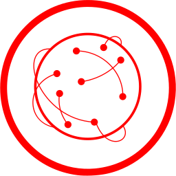

# Network
By [Daniel Gamage](https://thenounproject.com/danielgamage/), from the [Noun Project](https://thenounproject.com/term/network/49138/)

The project icon is pulled from 'TheNounProject', and adapted into the flat-circle icon approach.

The icon has been altered for the purposes of a project icon.

---
|||
|---|---|
|**Title**|Network|
|**Author**|[Daniel Gamage](https://thenounproject.com/danielgamage/)|
|**Source**|https://thenounproject.com/term/network/49138/|
|**License**|Public Domain|
|**Tags**|Network, Nodes, Networking, Networked, Internet, Global, Connections, Connected, Connect, Computer Network, Web|

---